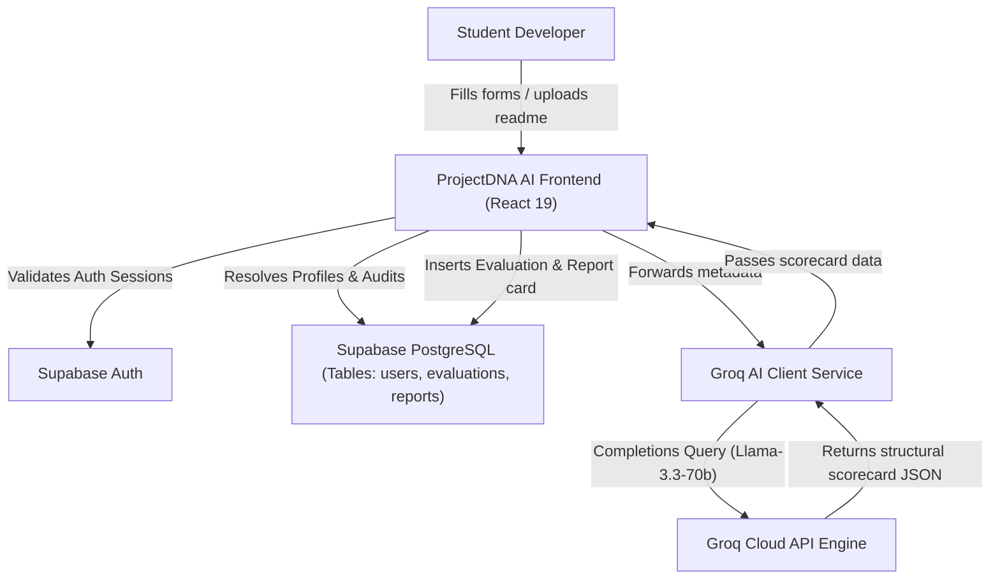
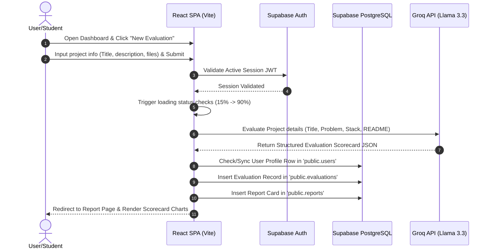

# 🚀 ProjectDNA AI

### AI-Powered Project Evaluation Platform

[](https://github.com/sivaasp5228/Project_DNA)
[](https://react.dev)
[](https://supabase.com)
[](https://console.groq.com)
[](https://opensource.org/licenses/MIT)

---

## 📖 Table of Contents
- [About the Project](#-about-the-project)
- [Problem Statement](#-problem-statement)
- [The Solution](#-the-solution)
- [Key Features](#-key-features)
- [System Architecture](#-system-architecture)
- [System Workflow](#-system-workflow)
- [Tech Stack](#-tech-stack)
- [Folder Structure](#-folder-structure)
- [Environment Variables](#-environment-variables)
- [Getting Started](#-getting-started)
- [Future Enhancements](#-future-enhancements)

---

## 🌱 About the Project

**ProjectDNA AI** is an intelligent, automated SaaS evaluation platform built to critique, benchmark, and score software projects before final submissions. 

Aligned with the **Sustainability & Social Impact** theme, ProjectDNA AI empowers student developers by providing them with transparent, multi-dimensional feedback. Instead of offering generic code auto-completions, it evaluates projects across 8 core metrics (Problem Clarity, Innovation, Technical Quality, Documentation, Scalability, Architectural Impact, Presentation, and Industry Readiness) to guide developers toward building accessible, production-grade solutions.

---

## ⚠️ Problem Statement

Project-based learning is a pillar of software education, hackathons, and bootcamps. However:
1. **Feedback Bottlenecks**: Evaluators and judges are often overwhelmed, leaving students with sparse feedback or simple numeric marks.
2. **Surface-Level Metrics**: Students rarely get feedback on hidden engineering properties—such as documentation completeness, system scalability, architectural choices, and structural sustainability.
3. **No Pre-Submission Checks**: There are few systems that help developers audit their codebases and presentation decks *before* submission, leading to wasted potential and suboptimal projects.

---

## 💡 The Solution

ProjectDNA AI provides students with a self-audit dashboard. By entering high-level project parameters (Title, Problem Statement, Stack) along with links (GitHub, Vercel) and optional project assets (README files, slide decks), students trigger a structured evaluation pipeline. 

The platform queries a custom Llama 3.3 model through the Groq Cloud API, validating and parsing a clean JSON scorecard. This scorecard details strengths, weaknesses, and concrete optimization paths, saving all reviews inside a Supabase database instance.

---

## 🌟 Key Features

- **8-Dimension AI Evaluation**: Scores projects across problem clarity, innovation, technical quality, documentation, scalability, impact, presentation, and industry readiness.
- **Dynamic Scorecards & Radar Charts**: Visualizes evaluation dimensions using Recharts-powered radar graphs and numeric score rings.
- **Interactive Checklist Loader**: Animates analysis steps in parallel with the live API request, creating a sleek user experience.
- **Self-Healing Profile Sync**: Automatically connects Supabase Auth metadata with public user records to resolve database constraints.
- **Evaluation History Logs**: Displays previous audits with quick-view scorecard cards.
- **Premium Dark UI**: Built with a sleek Vercel/Linear-inspired interface featuring premium glassmorphism, responsive grids, and clean layout spacing.

---

## 🏗️ System Architecture



---

## 🔄 System Workflow



---

## 🛠️ Tech Stack

| Technology Layer | Tool/Framework Used | Purpose |
| :--- | :--- | :--- |
| **Frontend Core** | React 19, TypeScript, Vite | Fast, type-safe Single Page Application development |
| **Styling** | Tailwind CSS v4, Lucide Icons | Responsive styling, clean utility layouts |
| **Components** | shadcn/ui primitives | Premium, accessible design system structures |
| **Database** | Supabase PostgreSQL | Secure storage for users, evaluations, and reports |
| **Authentication** | Supabase Auth | User registration, session persistence, and security |
| **AI Processing** | Groq SDK, Llama-3.3-70b-versatile | Rapid, deterministic JSON evaluation engine |
| **Data Visuals** | Recharts, Re-components | Interactive dashboard metrics and radar graphs |

---

## 📁 Folder Structure

```bash
client/
├── public/                 # Static assets (Favicons, vector icons)
└── src/
    ├── assets/             # Images and global icons
    ├── components/         # Reusable UI primitives (Buttons, Inputs, Cards)
    │   ├── Avatar.tsx      # Dicebear-powered user avatars
    │   ├── ScoreCard.tsx   # Scoring grid components
    │   ├── RadarChart.tsx  # Recharts implementation for 8-dimension reports
    │   └── ...
    ├── context/            # React global context providers
    │   ├── AuthContext.tsx        # Supabase Session listener
    │   └── EvaluationContext.tsx  # AI evaluation pipeline & history state
    ├── layouts/            # Component wrappers for pages
    │   ├── DashboardLayout.tsx
    │   └── LandingLayout.tsx
    ├── lib/                # Configured library clients
    │   └── supabase.ts     # Supabase client initializer
    ├── pages/              # Routed pages
    │   ├── DashboardPage.tsx      # Main workspace metrics
    │   ├── HistoryPage.tsx        # List of past audit records
    │   ├── LandingPage.tsx        # Premium product introduction page
    │   ├── LoginPage.tsx          # Login credentials entry
    │   ├── SignupPage.tsx         # Account registration page
    │   ├── NewEvaluationPage.tsx  # Project submission form
    │   └── ReportPage.tsx         # Full AI audit feedback page
    ├── services/           # Service-layer business logic
    │   ├── authService.ts         # User profiles & query aggregators
    │   ├── groqService.ts         # System prompts & Groq API bindings
    │   ├── evaluationService.ts   # Check validators & table record inserts
    │   └── reportService.ts       # Joined table selects
    ├── types/              # TypeScript interface definitions
    └── utils/              # Helper utilities
```

---

## 🔑 Environment Variables

To run the application, create a `.env` file inside the `client/` folder:

```env
# Supabase Configuration
VITE_SUPABASE_URL=https://your-supabase-id.supabase.co
VITE_SUPABASE_ANON_KEY=your_supabase_public_anon_key

# Groq Configuration
VITE_GROQ_API_KEY=gsk_your_groq_api_key
VITE_GROQ_MODEL=llama-3.3-70b-versatile
```

---

## 🚀 Getting Started

### 1. Database Setup
Run the SQL migration script (found in [walkthrough.md](file:///C:/Users/NEMU/.gemini/antigravity-ide/brain/c51e7eb9-50a1-47c3-b8e7-069a3b162511/walkthrough.md)) in your **Supabase SQL Editor** to create the tables, setup Row Level Security, and configure the user profile triggers.

### 2. Installation
Navigate to the client directory and install dependencies:
```bash
cd client
npm install
```

### 3. Start Development Server
Start the client server:
```bash
npm run dev
```

### 4. Build for Production
To build and check the production output locally:
```bash
npm run build
```

---

## 🔮 Future Enhancements

- **Direct GitHub Repository Scanning**: Read code structures directly via octokit/GitHub APIs to score repo files.
- **Resume & Team Evaluations**: Benchmark resume details alongside project metrics for team hackathon alignments.
- **Platform Analytics Compare**: Compare multiple evaluations of a project side-by-side to track iterative progress.
- **PDF Export**: Generate shareable, print-ready PDF scorecards for offline submissions.
- **Faculty Dashboard**: Enable course evaluators to view class-wide project quality analytics.

---
